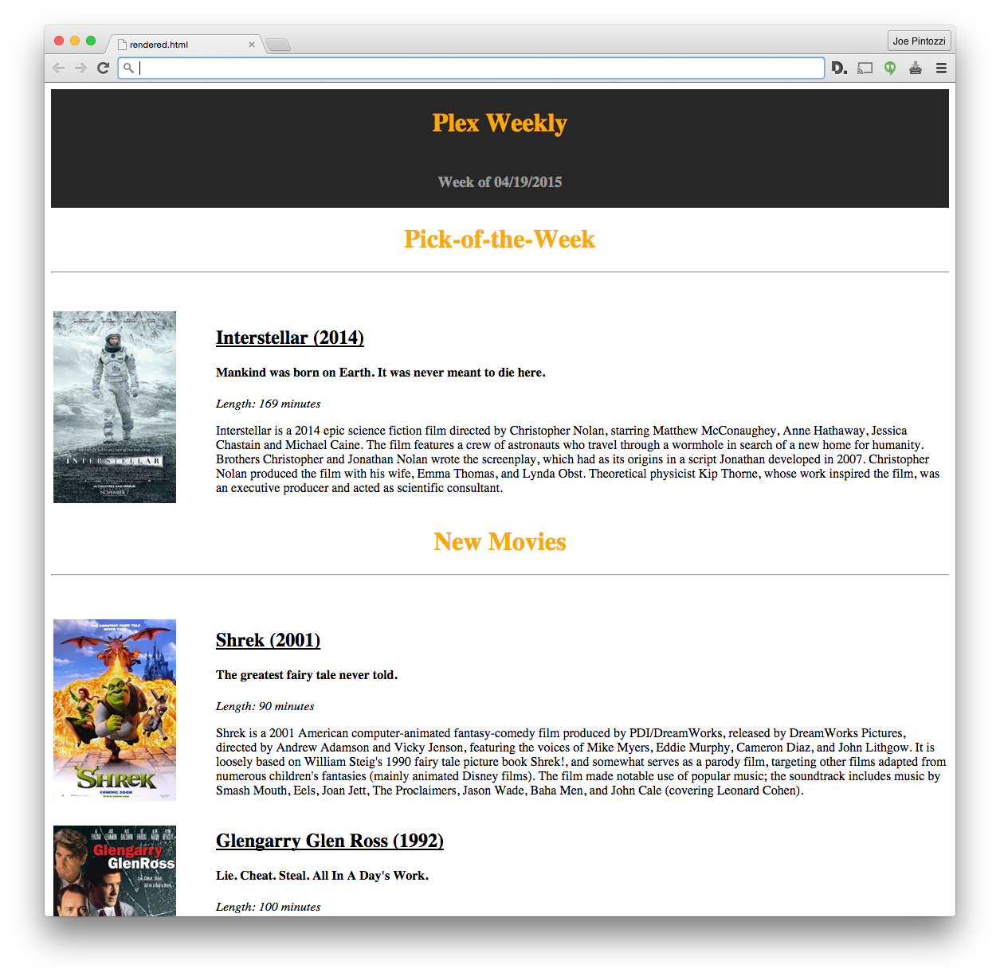

# Plex Weekly Email Generator

This is greatly inspired by jakewaldron's [PlexEmail](https://github.com/jakewaldron/PlexEmail) project. I decided to make this for a few reasons:

  * Python isn't my thing, Ruby is
  * The configuration/settings of PlexEmail seemed too complex and over the top
  * A smaller feature set felt easier to manage
  * I didn't want to worry about uploading movie posters to imgur

Now you can generate and send weekly Plex emails with just two commands!

    $ rake email:generate
    $ rake email:send

## General Info

### email:generate

The script itself is pretty simple.  It connects to your Plex server and pulls a few pieces of information:

  * The 4 most recently added movies (as recently released movies may not change often)
  * The 4 most recently aired TV shows
  * (Optionally) your movie pick of the week (specified by POTW in `.env`)

The information for those is then injected into the [Erubis](http://www.kuwata-lab.com/erubis/) `email.html.erb` template.  The completed email is written to `rendered.html`.  Posters for movies are pulled from [IMDB](http://www.imdb.com/), and TV shows from [The TVDB](http://thetvdb.com/).  The rest of the meta-data is pulled from Plex itself.

You can then send this right away, or modify it first, in case you want to add an announcement to the top or something of the sort.

### email:send

Takes `rendered.html` and sends it out via the specified SMTP server with the help of [pony](https://github.com/benprew/pony).

## Setup

All configuration and setup is done through the `.env` file.  There is an included sample at `.env.sample`. Copy that to `.env` and update the values.

### .env Keys

`TVDB_KEY`: required to fetch TV posters.  Can be obtained at <http://thetvdb.com/?tab=apiregister>.

`PLEX_TOKEN`: used to connect to your Plex server's API.  How to obtain it can be found [here](https://support.plex.tv/hc/en-us/articles/204059436-Finding-your-account-token-X-Plex-Token).

`PLEX_IP`: your Plex server's IP address.

`PLEX_MOVIE_SECTION`: the ID of the library section that has your movies. Can be found with `rake plex:sections`.

`PLEX_TV_SECTION`: the ID of the library section that has your TV shows. Can be found with `rake plex:sections`.

`EMAILS`: the email addresses you would like to send your newsletter too, separated by spaces.

`SMTP_ADDRESS`: the SMTP host you want to send emails through.  If you use [Mandrill](https://mandrill.com/), this will be `smtp.mandrillapp.com`.

`SMTP_PORT`: self explanatory, defaults to 587.

`SMTP_USER`: username.

`SMTP_PASS`: password.

`SMTP_DOMAIN`: the domain your email should appear to originate from.

`POTW`: the movie title for your pick-of-the-week.  **Not required**.  If included, your newsletter will have the pick-of-the-week at the top of the email.

### SMTP Server

You can use any SMTP server you want to send emails, though I find [Mandrill](https://mandrill.com/) quite easy to use, and you get 12,000 free emails a month.
